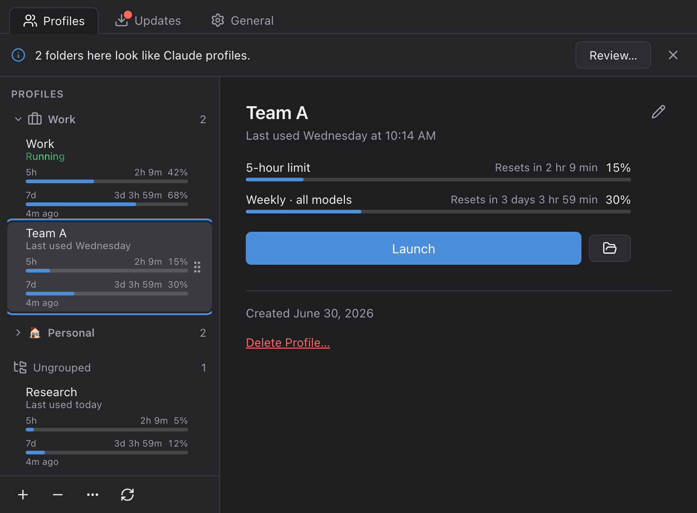
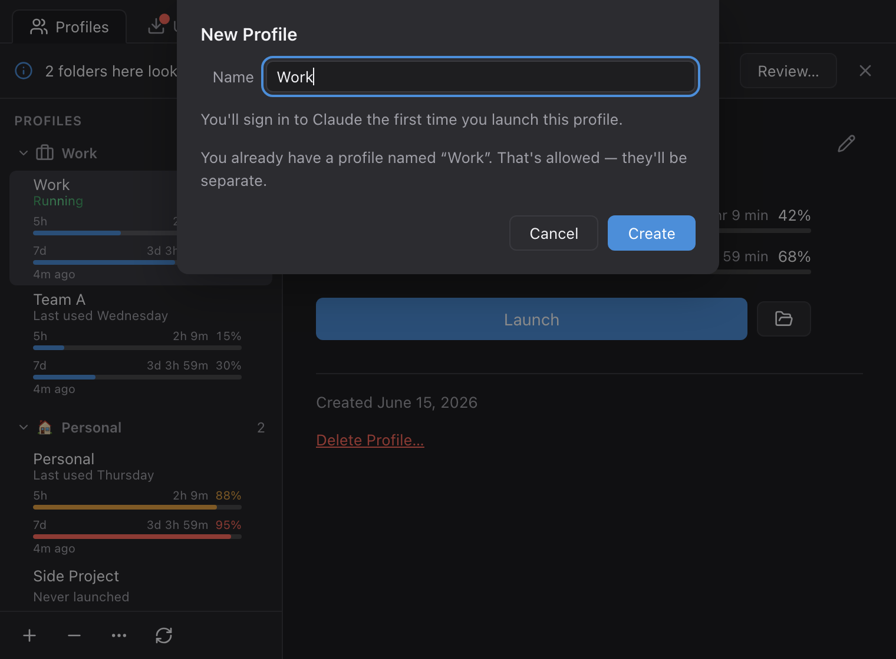
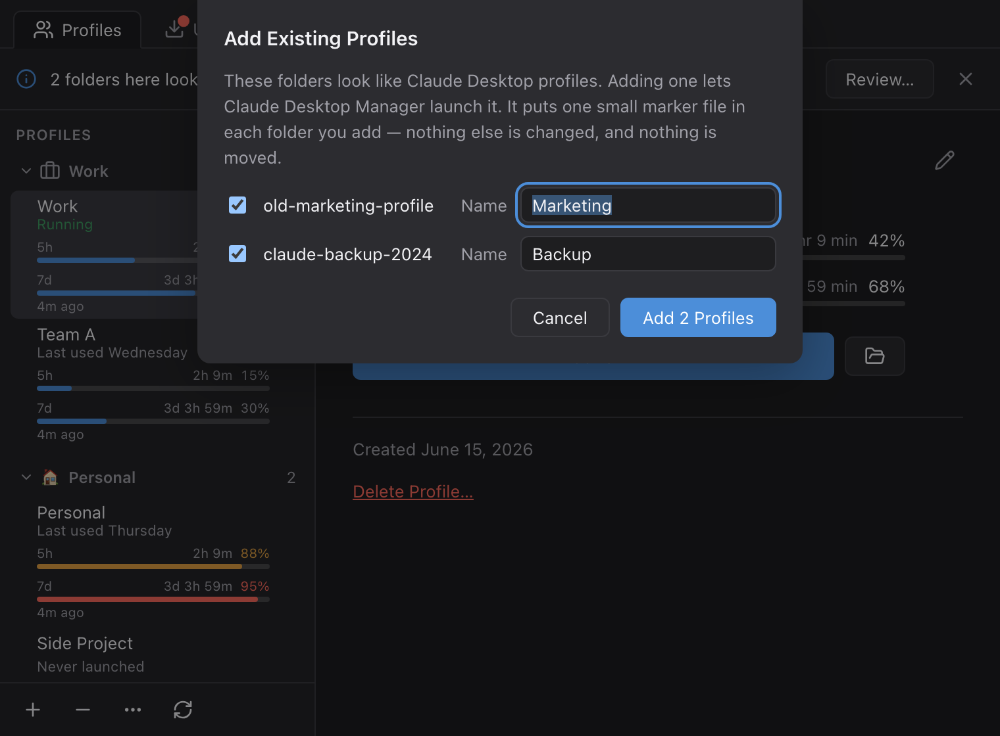
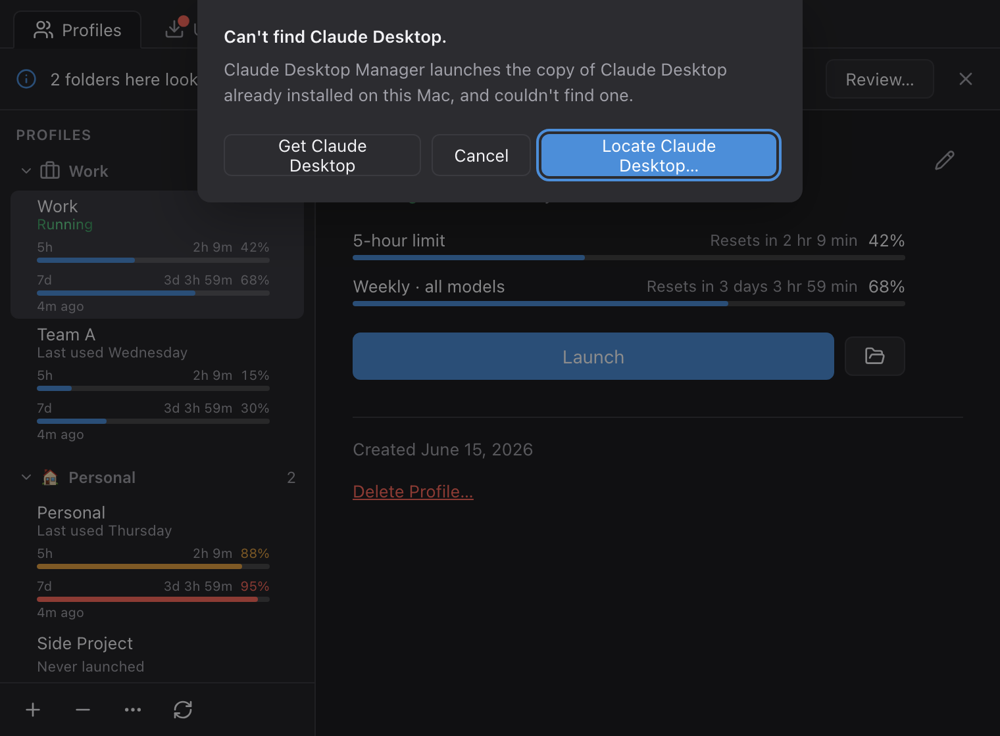
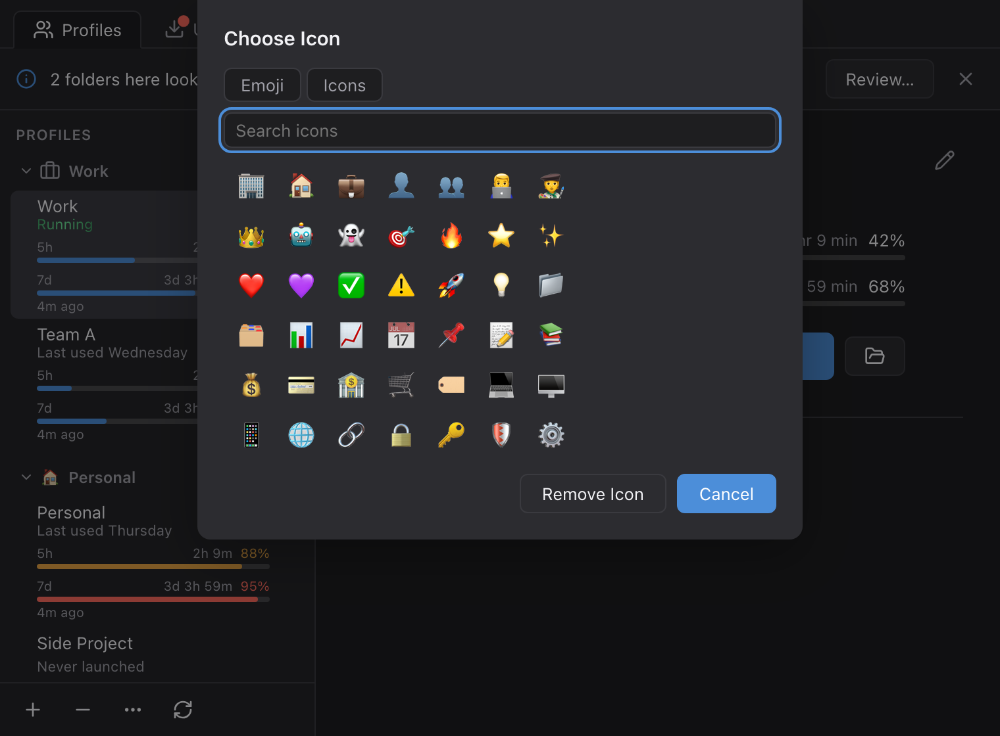
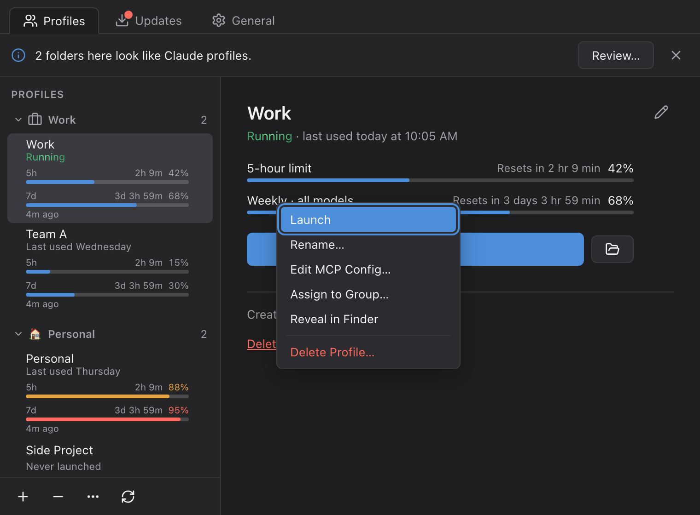
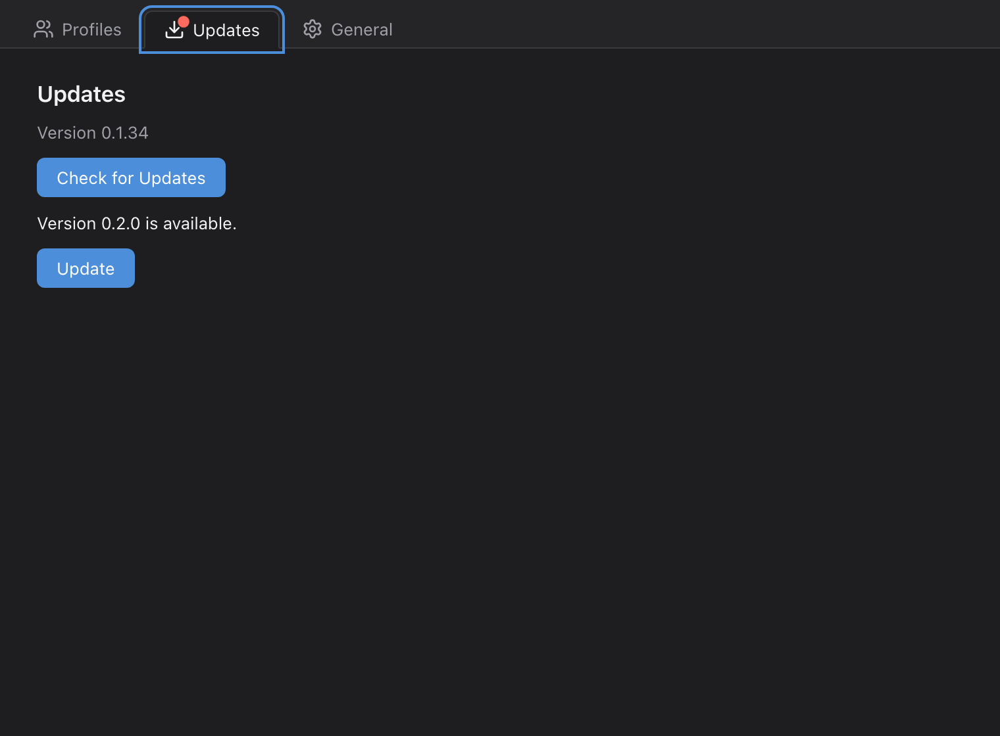
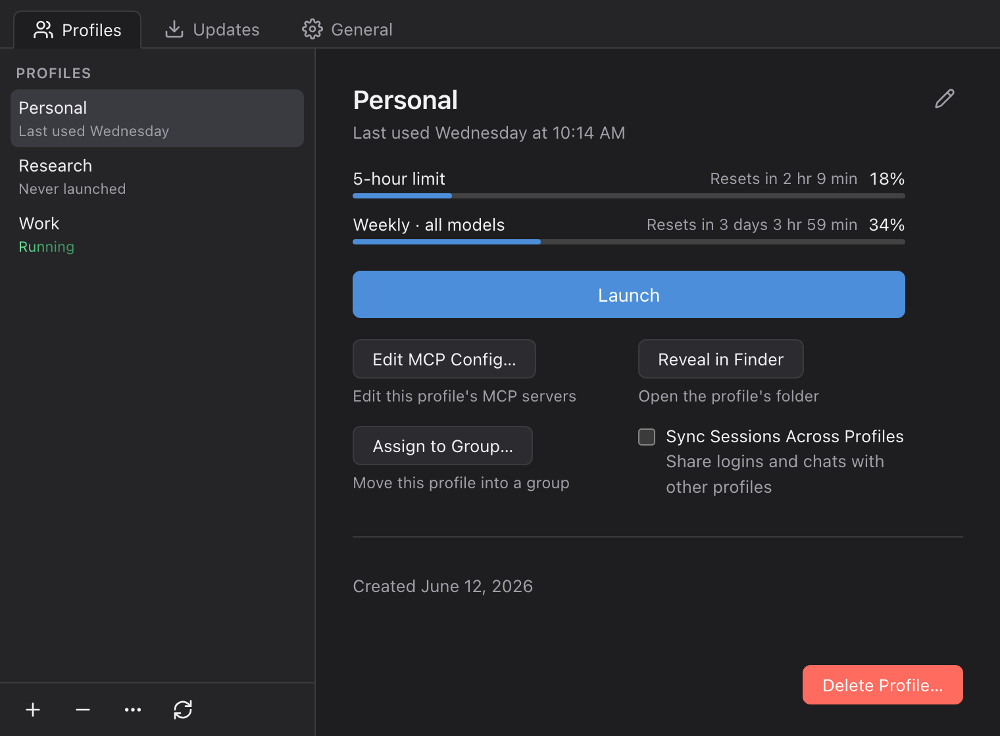
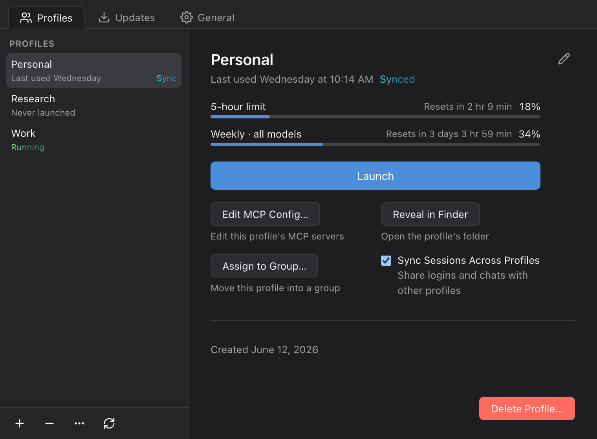
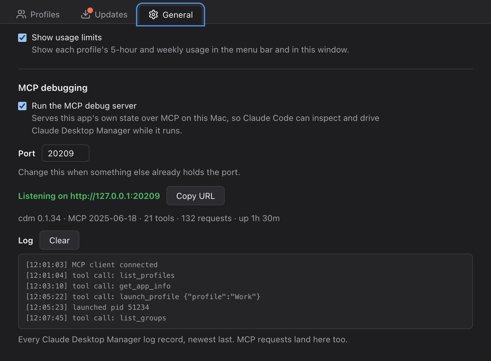

# Claude Desktop Manager

Claude Desktop Manager là ứng dụng macOS chạy nhiều Claude Desktop cùng lúc, mỗi bản một profile riêng, gom nhóm để quản lý, theo dõi giới hạn sử dụng và tự cập nhật.



## Mục lục

1. [Cài đặt](#1-cài-đặt)
2. [Hướng dẫn sử dụng](#2-hướng-dẫn-sử-dụng)
   1. [Thêm profile](#21-thêm-profile)
   2. [Định vị Claude Desktop](#22-định-vị-claude-desktop)
   3. [Nhóm profile](#23-nhóm-profile)
   4. [Khởi chạy](#24-khởi-chạy)
   5. [Cập nhật](#25-cập-nhật)
3. [Đồng bộ session giữa các profile](#3-đồng-bộ-session-giữa-các-profile)
   1. [Bật đồng bộ](#31-bật-đồng-bộ)
   2. [Tắt đồng bộ](#32-tắt-đồng-bộ)
   3. [Lưu ý](#33-lưu-ý)
4. [Cấu hình MCP (tuỳ chọn)](#4-cấu-hình-mcp-tuỳ-chọn)

---

## 1. Cài đặt

1. Tải file `.dmg` đúng chip máy tại [Releases](../../releases/latest): bản `aarch64` cho Apple Silicon, bản `x64` cho Intel.
2. Mở `.dmg`, kéo **Claude Desktop Manager** vào Applications.
3. Mở ứng dụng từ Applications (hoặc Spotlight).

Nếu macOS báo "Claude Desktop Manager" is damaged and can't be opened, chạy lệnh sau rồi mở lại app:

```bash
xattr -dr com.apple.quarantine "/Applications/Claude Desktop Manager.app"
```

Nếu vẫn không mở được, chạy thêm:

```bash
codesign --force --deep --sign - "/Applications/Claude Desktop Manager.app"
```

---

## 2. Hướng dẫn sử dụng

Claude Desktop Manager nằm ở thanh menu bar, không có icon Dock. Cửa sổ Preferences có ba tab "Profiles", "Updates", "General" — các mục dưới đây nằm trong đó.

### 2.1. Thêm profile

Hai cách thêm profile: tạo mới, hoặc "nhận" (adopt) thư mục Claude Desktop có sẵn.

**Tạo mới:**

1. Tab "Profiles", nhấn "New Profile" (dấu +) trên toolbar — hoặc "New Profile" giữa màn hình nếu chưa có profile nào.
2. Nhập tên vào ô "Name" (ví dụ `Work`), nhấn "Create".
3. Mở profile vừa tạo, đăng nhập Claude ở lần chạy đầu — chưa cần đăng nhập lúc tạo.



**Nhận thư mục có sẵn:** nếu phát hiện thư mục giống profile Claude Desktop chưa quản lý, banner hiện lên, ví dụ "2 folders here look like Claude profiles.", kèm nút "Review…" — hoặc tự mở bằng "…" (More Actions) → "Add Existing Folder…".

1. Hộp thoại "Add Existing Profiles": thư mục tìm thấy được tick sẵn — bỏ tick thư mục không muốn thêm.
2. Sửa tên ở ô "Name" cạnh mỗi thư mục nếu muốn.
3. Nhấn "Add Profile" (hoặc "Add N Profiles" nếu chọn nhiều thư mục).

Thao tác chỉ thêm một file đánh dấu nhỏ vào thư mục — không di chuyển hay thay đổi gì.



Ghi chú: mỗi profile có file cấu hình MCP riêng. Chuột phải vào profile → "Edit MCP Config…" để mở bằng trình soạn thảo mặc định.

### 2.2. Định vị Claude Desktop

Nếu không tìm thấy Claude Desktop đã cài (thường gặp khi chạy profile lần đầu), hộp thoại "Can't find Claude Desktop." hiện ra với hai lựa chọn:

- "Locate Claude Desktop…" — mở hộp thoại chọn file (bắt đầu tại Applications) để tự chỉ đến app Claude đã cài.
- "Get Claude Desktop" — mở trang tải Claude Desktop trong trình duyệt.



### 2.3. Nhóm profile

- **Tạo nhóm:** "…" (More Actions) trên toolbar → "New Group…" → nhập "Name" → "Create".
- **Đổi icon nhóm:** chuột phải vào tên nhóm → "Choose Icon…" → tab "Emoji" hoặc "Icons" (gõ ô "Search icons" để tìm nhanh) → chọn icon, hoặc "Remove Icon" để bỏ.
- **Đổi tên / xoá nhóm:** cũng từ menu chuột phải — "Rename Group…" hoặc "Delete Group…" (xoá nhóm không xoá profile bên trong, chúng về "Ungrouped").
- **Di chuyển profile vào nhóm:** kéo tay cầm bên phải dòng profile để sắp xếp hoặc thả sang nhóm khác; hoặc chuột phải vào profile → "Assign to Group…" → chọn nhóm (hoặc "No group") → "Assign".



### 2.4. Khởi chạy

1. Chọn profile trong danh sách bên trái.
2. Nhấn "Launch" trong khung chi tiết (hoặc double-click dòng profile, hoặc chuột phải → "Launch"). Nút tạm đổi thành "Launching…".
3. Đang chạy, trạng thái "Running" hiện trên cả dòng profile và khung chi tiết.
4. Có thể chạy nhiều profile cùng lúc; mỗi profile là tiến trình riêng, dữ liệu tách biệt (trừ khi bật [đồng bộ session](#3-đồng-bộ-session-giữa-các-profile)).
5. Muốn dừng, thoát cửa sổ Claude Desktop như app bình thường (⌘Q) — Claude Desktop Manager không có nút thoát riêng. Đổi tên hoặc xoá profile đang chạy sẽ yêu cầu thoát trước: nút xác nhận đổi thành "Quit & Rename" / "Quit & Delete". Nếu Claude không chịu thoát, hộp thoại "isn't quitting" hiện ra kèm nút "Force Quit".



### 2.5. Cập nhật

1. Mở tab "Updates" trong Preferences.
2. App tự kiểm tra bản mới theo định kỳ; hoặc nhấn "Check for Updates" để kiểm tra ngay.
3. Có bản mới thì dòng "Version X is available." hiện ra kèm nút "Update" — nhấn để tải và cài.
4. Cài xong, dòng "Version X is installed. Restart Claude Desktop Manager to start using it." hiện ra kèm nút "Restart Now". Profile đang chạy không bị ảnh hưởng — có thể bỏ qua, bản mới tự áp dụng ở lần mở app kế tiếp.
5. Hoặc vào thẳng [Releases](../../releases/latest), tải `.dmg` mới nhất và cài đè lên bản cũ như mục [Cài đặt](#1-cài-đặt).



---

## 3. Đồng bộ session giữa các profile

Bật đồng bộ để nhiều profile dùng chung một kho session Claude Code; đăng nhập và cấu hình MCP của mỗi profile vẫn riêng.

### 3.1. Bật đồng bộ

1. Thoát Claude Desktop của profile đó (⌘Q).
2. Bật công tắc "Sync Sessions Across Profiles" trong khung chi tiết, hoặc chuột phải profile → chọn mục này.

   

3. Session sẵn có được gộp vào kho chung (trùng đường dẫn thì bản mới hơn thắng, không xoá gì); khung chi tiết hiện "Synced", profile có thêm nhãn "Sync".

   

Ghi chú: profile đang chạy chỉ nhận thay đổi từ kho chung ở lần khởi chạy kế tiếp.

### 3.2. Tắt đồng bộ

Tắt bằng chính công tắc đó, hoặc chuột phải → "✓ Sync Sessions Across Profiles". Profile giữ lại bản chụp kho chung tại thời điểm đó, rồi tách biệt trở lại.

### 3.3. Lưu ý

- Phải thoát profile trước khi bật/tắt, nếu không thao tác báo lỗi "Couldn't join session sync." / "Couldn't leave session sync.".
- Kho chung là một danh sách dùng chung cho mọi thành viên, kể cả khi đăng nhập tài khoản Claude khác nhau.
- Xoá một session ở profile này thì các profile thành viên khác cũng mất session đó.
- Đừng xoá thư mục `session-pool` trong dữ liệu app — mất kho chung, không tự khôi phục được.

---

## 4. Cấu hình MCP (tuỳ chọn)

Claude Desktop Manager có MCP debug server nội bộ, cho phép MCP client (ví dụ Claude Code) đọc và điều khiển ứng dụng khi đang chạy. Mặc định TẮT.

1. Tab "General" trong Preferences, mục "MCP debugging".
2. Bật công tắc "Run the MCP debug server".
3. Cổng mặc định `20205`, đổi ở ô "Port" bên dưới nếu cổng bị chiếm.
4. Khi chạy, dòng "Listening on http://127.0.0.1:<port>/mcp" hiện ra kèm nút "Copy URL"; bên dưới có khung "Log" ghi request gần nhất (nút "Clear" để xoá).

Trỏ Claude Code (hoặc MCP client khác hỗ trợ HTTP) vào server bằng entry dạng:

```json
{
  "mcpServers": {
    "cdm": {
      "type": "http",
      "url": "http://127.0.0.1:20205/mcp"
    }
  }
}
```

Nếu tự đặt biến môi trường `CDM_MCP_PORT` khi mở app, giá trị đó đè lên công tắc và ô Port ở trên; tab "General" hiện thêm dòng ghi chú giải thích.

Ghi chú: đây là server điều khiển chính Claude Desktop Manager. Cấu hình MCP cho từng Claude Desktop trong mỗi profile là chuyện khác — chuột phải profile → "Edit MCP Config…" như ở mục [Thêm profile](#21-thêm-profile).


